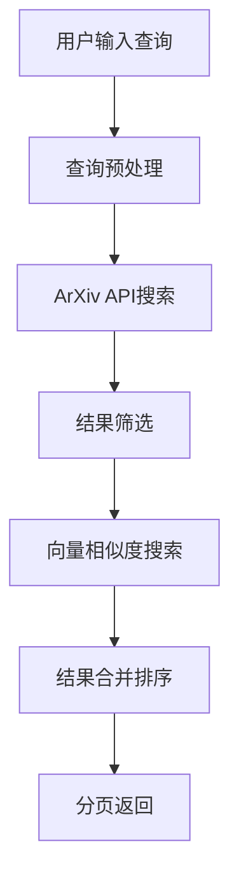
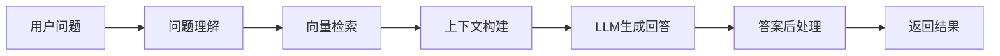

# 论文搜索引擎技术实现文档

## 项目概述

本项目是一个基于RAG（检索增强生成）技术的智能论文搜索引擎，支持论文搜索、智能问答和论文下载功能。项目采用前后端分离架构，后端使用Python FastAPI框架，前端使用HTML/CSS/JavaScript，支持本地LLM部署和在线API调用。

## 技术架构

### 系统架构图

```
┌─────────────────┐    ┌─────────────────┐    ┌─────────────────┐
│   前端界面      │    │   后端API       │    │   数据源        │
│                 │    │                 │    │                 │
│ • HTML/CSS/JS   │◄──►│ • FastAPI       │◄──►│ • ArXiv API     │
│ • Bootstrap     │    │ • LangChain     │    │ • 向量数据库    │
│ • 响应式设计    │    │ • RAG流水线     │    │ • 本地LLM       │
└─────────────────┘    └─────────────────┘    └─────────────────┘
```

### 核心组件

1. **前端层**
   - 用户界面：基于Bootstrap的响应式设计
   - 搜索功能：实时搜索和高级筛选
   - 智能问答：基于RAG的对话界面
   - 论文管理：收藏、下载、查看详情

2. **后端层**
   - API服务：FastAPI框架提供RESTful接口
   - 搜索服务：ArXiv API集成和向量搜索
   - 问答服务：基于LangChain的RAG系统
   - 数据处理：文本预处理和向量化

3. **数据层**
   - ArXiv论文库：主要数据源
   - 向量数据库：ChromaDB存储论文向量
   - 本地LLM：Qwen模型进行推理
   - 缓存系统：Redis缓存搜索结果

## 技术栈详解

### 后端技术栈

#### 1. Web框架 - FastAPI
```python
# 主要特性
- 高性能异步框架
- 自动API文档生成
- 类型提示支持
- 数据验证和序列化
```

#### 2. 大模型框架 - LangChain 0.3
```python
# 核心组件
from langchain.llms import Qwen
from langchain.embeddings import SentenceTransformerEmbeddings
from langchain.vectorstores import Chroma
from langchain.chains import RetrievalQA
```

#### 3. 向量数据库 - ChromaDB
```python
# 向量存储配置
vector_store = Chroma(
    collection_name="papers",
    embedding_function=embeddings,
    persist_directory="./data/chroma"
)
```

#### 4. 文本处理 - Sentence Transformers
```python
# 嵌入模型
embeddings = SentenceTransformerEmbeddings(
    model_name="all-MiniLM-L6-v2"
)
```

### 前端技术栈

#### 1. 基础技术
- **HTML5**: 语义化标记
- **CSS3**: 响应式设计和动画
- **JavaScript ES6+**: 现代JavaScript特性

#### 2. UI框架
- **Bootstrap 5**: 响应式布局和组件
- **Font Awesome**: 图标库
- **自定义CSS**: 项目特定样式

#### 3. 交互功能
- **Fetch API**: 异步数据请求
- **DOM操作**: 动态内容更新
- **事件处理**: 用户交互响应

## 核心功能实现

### 1. 论文搜索功能

#### 搜索流程


#### 实现代码
```python
async def search_papers(self, query: str, limit: int = 10) -> Dict[str, Any]:
    """搜索论文的核心逻辑"""
    
    # 1. 预处理查询
    processed_query = self.text_processor.preprocess_query(query)
    
    # 2. ArXiv API搜索
    arxiv_results = await self.arxiv_client.search(
        query=processed_query,
        max_results=limit * 2
    )
    
    # 3. 向量相似度搜索
    if self.vector_store.is_available():
        vector_results = await self.vector_store.similarity_search(
            query=processed_query,
            limit=limit
        )
        # 合并结果
        results = self._merge_results(arxiv_results, vector_results)
    else:
        results = arxiv_results
    
    # 4. 排序和分页
    sorted_results = self._sort_results(results, processed_query)
    
    return {
        "papers": sorted_results[:limit],
        "total": len(sorted_results),
        "query": query,
        "took": time.time() - start_time
    }
```

### 2. RAG问答系统

#### RAG架构


#### 实现代码
```python
class QAService:
    def __init__(self):
        self.llm = Qwen()
        self.vector_store = VectorStore()
        self.retrieval_chain = RetrievalQA.from_chain_type(
            llm=self.llm,
            chain_type="stuff",
            retriever=self.vector_store.as_retriever()
        )
    
    async def ask_question(self, question: str) -> Dict[str, Any]:
        """RAG问答实现"""
        
        # 1. 检索相关文档
        relevant_docs = await self.vector_store.similarity_search(
            query=question,
            k=5
        )
        
        # 2. 构建上下文
        context = self._build_context(relevant_docs)
        
        # 3. 生成回答
        response = await self.retrieval_chain.arun(
            query=question,
            context=context
        )
        
        # 4. 提取来源
        sources = self._extract_sources(relevant_docs)
        
        return {
            "answer": response,
            "sources": sources,
            "confidence": self._calculate_confidence(response),
            "question": question
        }
```

### 3. 本地LLM部署

#### Qwen模型部署
```python
# 模型配置
class QwenConfig:
    model_name = "Qwen/Qwen-7B-Chat"
    device = "cuda" if torch.cuda.is_available() else "cpu"
    max_length = 2048
    temperature = 0.7
    
# 模型初始化
def load_qwen_model():
    model = Qwen.from_pretrained(
        QwenConfig.model_name,
        device_map="auto",
        torch_dtype=torch.float16
    )
    return model
```

#### LangChain集成
```python
from langchain.llms import Qwen
from langchain.chains import LLMChain
from langchain.prompts import PromptTemplate

# 创建LLM实例
llm = Qwen(
    model_name="Qwen/Qwen-7B-Chat",
    temperature=0.7,
    max_tokens=512
)

# 创建问答链
qa_chain = LLMChain(
    llm=llm,
    prompt=PromptTemplate(
        input_variables=["context", "question"],
        template="基于以下上下文回答问题：\n{context}\n\n问题：{question}\n回答："
    )
)
```

## 部署方案

### 1. 本地开发环境

#### 环境准备
```bash
# 创建虚拟环境
python -m venv venv
source venv/bin/activate  # Linux/Mac
# 或
venv\Scripts\activate  # Windows

# 安装依赖
pip install -r requirements.txt
```

#### 启动服务
```bash
# 启动后端服务
cd backend
python main.py

# 启动前端服务
cd frontend
python -m http.server 8000
```

### 2. Netlify部署

#### 部署配置
```yaml
# netlify.toml
[build]
  command = "npm run build"
  publish = "dist"

[build.environment]
  NODE_VERSION = "18"

[[redirects]]
  from = "/api/*"
  to = "https://your-backend-api.com/api/:splat"
  status = 200
```

#### 环境变量配置
```bash
# Netlify环境变量
VITE_API_BASE_URL=https://your-backend-api.com
VITE_LLM_API_KEY=your-llm-api-key
```

### 3. 生产环境配置

#### Docker部署
```dockerfile
# Dockerfile
FROM python:3.9-slim

WORKDIR /app

COPY requirements.txt .
RUN pip install -r requirements.txt

COPY . .

EXPOSE 8000

CMD ["uvicorn", "main:app", "--host", "0.0.0.0", "--port", "8000"]
```

#### 环境变量
```bash
# .env
HOST=0.0.0.0
PORT=8000
DEBUG=False
LLM_MODEL_PATH=/models/qwen
VECTOR_DB_PATH=/data/chroma
REDIS_URL=redis://localhost:6379
```

## 性能优化

### 1. 缓存策略
```python
# Redis缓存配置
import redis
from functools import wraps

redis_client = redis.Redis(host='localhost', port=6379, db=0)

def cache_result(expire_time=3600):
    def decorator(func):
        @wraps(func)
        async def wrapper(*args, **kwargs):
            cache_key = f"{func.__name__}:{hash(str(args) + str(kwargs))}"
            
            # 尝试从缓存获取
            cached_result = redis_client.get(cache_key)
            if cached_result:
                return json.loads(cached_result)
            
            # 执行函数并缓存结果
            result = await func(*args, **kwargs)
            redis_client.setex(cache_key, expire_time, json.dumps(result))
            
            return result
        return wrapper
    return decorator
```

### 2. 异步处理
```python
# 异步任务队列
import asyncio
from concurrent.futures import ThreadPoolExecutor

class AsyncTaskManager:
    def __init__(self):
        self.executor = ThreadPoolExecutor(max_workers=4)
    
    async def process_papers(self, papers):
        """异步处理论文数据"""
        tasks = [self.process_single_paper(paper) for paper in papers]
        results = await asyncio.gather(*tasks)
        return results
    
    async def process_single_paper(self, paper):
        """处理单篇论文"""
        loop = asyncio.get_event_loop()
        return await loop.run_in_executor(
            self.executor, 
            self._process_paper_sync, 
            paper
        )
```

### 3. 数据库优化
```python
# 向量数据库索引优化
class OptimizedVectorStore:
    def __init__(self):
        self.chroma_client = chromadb.Client()
        self.collection = self.chroma_client.create_collection(
            name="papers",
            metadata={"hnsw:space": "cosine"}
        )
    
    def create_index(self):
        """创建向量索引"""
        self.collection.create_index(
            index_type="hnsw",
            metric="cosine",
            ef_construction=200,
            m=16
        )
```

## 安全考虑

### 1. API安全
```python
# API限流
from slowapi import Limiter, _rate_limit_exceeded_handler
from slowapi.util import get_remote_address

limiter = Limiter(key_func=get_remote_address)

@app.post("/api/search/")
@limiter.limit("10/minute")
async def search_papers(request: Request, ...):
    pass
```

### 2. 数据验证
```python
# 输入验证
from pydantic import BaseModel, validator

class SearchRequest(BaseModel):
    query: str
    limit: int = 10
    
    @validator('query')
    def validate_query(cls, v):
        if len(v.strip()) < 2:
            raise ValueError('查询长度至少2个字符')
        return v.strip()
    
    @validator('limit')
    def validate_limit(cls, v):
        if v > 100:
            raise ValueError('单次查询最多100条结果')
        return v
```

### 3. 错误处理
```python
# 全局异常处理
@app.exception_handler(Exception)
async def global_exception_handler(request: Request, exc: Exception):
    logger.error(f"全局异常: {str(exc)}")
    return JSONResponse(
        status_code=500,
        content={"message": "服务器内部错误"}
    )
```

## 监控和日志

### 1. 日志配置
```python
# 结构化日志
import structlog

logger = structlog.get_logger()

# 使用示例
logger.info("搜索请求", query=query, user_id=user_id)
logger.error("搜索失败", error=str(e), query=query)
```

### 2. 性能监控
```python
# 性能指标收集
import time
from functools import wraps

def monitor_performance(func):
    @wraps(func)
    async def wrapper(*args, **kwargs):
        start_time = time.time()
        try:
            result = await func(*args, **kwargs)
            duration = time.time() - start_time
            logger.info("函数执行完成", 
                       function=func.__name__, 
                       duration=duration)
            return result
        except Exception as e:
            duration = time.time() - start_time
            logger.error("函数执行失败", 
                        function=func.__name__, 
                        duration=duration, 
                        error=str(e))
            raise
    return wrapper
```

## 测试策略

### 1. 单元测试
```python
# 测试示例
import pytest
from unittest.mock import Mock, patch

class TestSearchService:
    @pytest.fixture
    def search_service(self):
        return SearchService()
    
    @patch('services.search_service.ArxivClient')
    async def test_search_papers(self, mock_arxiv, search_service):
        # 模拟ArXiv API响应
        mock_arxiv.return_value.search.return_value = [
            {"title": "Test Paper", "authors": ["Author1"]}
        ]
        
        result = await search_service.search_papers("test query")
        
        assert len(result["papers"]) == 1
        assert result["papers"][0]["title"] == "Test Paper"
```

### 2. 集成测试
```python
# API集成测试
import httpx

async def test_search_api():
    async with httpx.AsyncClient() as client:
        response = await client.post(
            "http://localhost:8000/api/search/",
            json={"query": "machine learning", "limit": 5}
        )
        
        assert response.status_code == 200
        data = response.json()
        assert "papers" in data
        assert len(data["papers"]) <= 5
```

## 扩展计划

### 1. 功能扩展
- [ ] 用户认证和个性化推荐
- [ ] 论文引用关系分析
- [ ] 多语言支持
- [ ] 移动端适配

### 2. 技术升级
- [ ] 微服务架构改造
- [ ] 分布式向量数据库
- [ ] 实时搜索建议
- [ ] 智能摘要生成

### 3. 性能优化
- [ ] CDN加速
- [ ] 数据库分片
- [ ] 缓存预热
- [ ] 负载均衡

## 8. 性能优化

### 8.1 搜索性能优化

#### 缓存策略
```python
# 实现Redis缓存
import redis
from functools import wraps
import json

redis_client = redis.Redis(host='localhost', port=6379, db=0)

def cache_result(expire_time=3600):
    def decorator(func):
        @wraps(func)
        async def wrapper(*args, **kwargs):
            cache_key = f"{func.__name__}:{hash(str(args) + str(kwargs))}"
            cached_result = redis_client.get(cache_key)
            if cached_result:
                return json.loads(cached_result)
            
            result = await func(*args, **kwargs)
            redis_client.setex(cache_key, expire_time, json.dumps(result))
            return result
        return wrapper
    return decorator
```

#### 异步处理
```python
# 异步搜索实现
import asyncio
from concurrent.futures import ThreadPoolExecutor

async def search_papers_async(query: str, max_results: int = 10):
    """异步搜索论文"""
    with ThreadPoolExecutor() as executor:
        loop = asyncio.get_event_loop()
        papers = await loop.run_in_executor(
            executor, 
            search_arxiv_sync, 
            query, 
            max_results
        )
    return papers
```

### 8.2 LLM性能优化

#### 模型量化
```python
# 使用量化模型减少内存占用
from transformers import AutoModelForCausalLM, AutoTokenizer
import torch

def load_quantized_model(model_path):
    """加载量化模型"""
    model = AutoModelForCausalLM.from_pretrained(
        model_path,
        torch_dtype=torch.float16,
        device_map="auto",
        load_in_8bit=True  # 8位量化
    )
    return model
```

#### 批处理优化
```python
# 批处理问答请求
async def batch_qa(questions: List[str]):
    """批量处理问答请求"""
    batch_size = 4
    results = []
    
    for i in range(0, len(questions), batch_size):
        batch = questions[i:i+batch_size]
        batch_results = await process_qa_batch(batch)
        results.extend(batch_results)
    
    return results
```

### 8.3 前端性能优化

#### 懒加载
```javascript
// 实现搜索结果懒加载
class LazyLoader {
    constructor(container, loadMoreCallback) {
        this.container = container;
        this.loadMoreCallback = loadMoreCallback;
        this.observer = new IntersectionObserver(this.handleIntersection.bind(this));
    }
    
    handleIntersection(entries) {
        entries.forEach(entry => {
            if (entry.isIntersecting) {
                this.loadMoreCallback();
            }
        });
    }
}
```

#### 虚拟滚动
```javascript
// 虚拟滚动优化大量数据渲染
class VirtualScroll {
    constructor(container, itemHeight, items) {
        this.container = container;
        this.itemHeight = itemHeight;
        this.items = items;
        this.visibleStart = 0;
        this.visibleEnd = 0;
    }
    
    render() {
        const containerHeight = this.container.clientHeight;
        const visibleCount = Math.ceil(containerHeight / this.itemHeight);
        
        this.visibleEnd = Math.min(
            this.visibleStart + visibleCount,
            this.items.length
        );
        
        this.renderVisibleItems();
    }
}
```

## 9. 安全考虑

### 9.1 输入验证

#### 参数验证
```python
from pydantic import BaseModel, validator
import re

class SearchRequest(BaseModel):
    query: str
    max_results: int = 10
    
    @validator('query')
    def validate_query(cls, v):
        if len(v) < 3:
            raise ValueError('查询长度至少3个字符')
        if len(v) > 200:
            raise ValueError('查询长度不能超过200个字符')
        # 防止SQL注入
        if re.search(r'[;\'"]', v):
            raise ValueError('查询包含非法字符')
        return v
    
    @validator('max_results')
    def validate_max_results(cls, v):
        if v < 1 or v > 50:
            raise ValueError('结果数量必须在1-50之间')
        return v
```

#### 文件上传安全
```python
import magic
from pathlib import Path

def validate_pdf_file(file_path: str) -> bool:
    """验证PDF文件安全性"""
    # 检查文件类型
    file_type = magic.from_file(file_path, mime=True)
    if file_type != 'application/pdf':
        return False
    
    # 检查文件大小
    file_size = Path(file_path).stat().st_size
    if file_size > 50 * 1024 * 1024:  # 50MB限制
        return False
    
    return True
```

### 9.2 访问控制

#### API限流
```python
from slowapi import Limiter, _rate_limit_exceeded_handler
from slowapi.util import get_remote_address
from slowapi.errors import RateLimitExceeded

limiter = Limiter(key_func=get_remote_address)
app.state.limiter = limiter
app.add_exception_handler(RateLimitExceeded, _rate_limit_exceeded_handler)

@app.post("/api/qa/ask")
@limiter.limit("10/minute")
async def ask_question(request: Request, question: str):
    # 问答逻辑
    pass
```

#### 内容过滤
```python
import re
from typing import List

class ContentFilter:
    def __init__(self):
        self.blocked_patterns = [
            r'<script.*?>.*?</script>',
            r'javascript:',
            r'on\w+\s*=',
        ]
    
    def filter_content(self, content: str) -> str:
        """过滤危险内容"""
        for pattern in self.blocked_patterns:
            content = re.sub(pattern, '', content, flags=re.IGNORECASE)
        return content
```

## 10. 监控和日志

### 10.1 应用监控

#### 性能监控
```python
import time
from functools import wraps
import logging

def monitor_performance(func):
    @wraps(func)
    async def wrapper(*args, **kwargs):
        start_time = time.time()
        try:
            result = await func(*args, **kwargs)
            duration = time.time() - start_time
            logging.info(f"{func.__name__} completed in {duration:.2f}s")
            return result
        except Exception as e:
            duration = time.time() - start_time
            logging.error(f"{func.__name__} failed after {duration:.2f}s: {str(e)}")
            raise
    return wrapper
```

#### 健康检查
```python
@app.get("/health")
async def health_check():
    """系统健康检查"""
    health_status = {
        "status": "healthy",
        "timestamp": datetime.now().isoformat(),
        "version": "1.0.0",
        "services": {
            "database": check_database_health(),
            "llm": check_llm_health(),
            "vector_store": check_vector_store_health(),
            "redis": check_redis_health()
        }
    }
    return health_status
```

### 10.2 日志系统

#### 结构化日志
```python
import structlog
import logging

# 配置结构化日志
structlog.configure(
    processors=[
        structlog.stdlib.filter_by_level,
        structlog.stdlib.add_logger_name,
        structlog.stdlib.add_log_level,
        structlog.stdlib.PositionalArgumentsFormatter(),
        structlog.processors.TimeStamper(fmt="iso"),
        structlog.processors.StackInfoRenderer(),
        structlog.processors.format_exc_info,
        structlog.processors.UnicodeDecoder(),
        structlog.processors.JSONRenderer()
    ],
    context_class=dict,
    logger_factory=structlog.stdlib.LoggerFactory(),
    wrapper_class=structlog.stdlib.BoundLogger,
    cache_logger_on_first_use=True,
)

logger = structlog.get_logger()
```

## 11. 测试策略

### 11.1 单元测试

#### 后端测试
```python
import pytest
from fastapi.testclient import TestClient
from unittest.mock import patch, MagicMock

class TestSearchAPI:
    def setup_method(self):
        self.client = TestClient(app)
    
    def test_search_papers_success(self):
        """测试成功搜索论文"""
        with patch('services.search_service.search_arxiv_papers') as mock_search:
            mock_search.return_value = [
                {
                    "id": "test123",
                    "title": "Test Paper",
                    "authors": ["Author1", "Author2"]
                }
            ]
            
            response = self.client.get("/api/search?query=test")
            assert response.status_code == 200
            data = response.json()
            assert len(data) == 1
            assert data[0]["title"] == "Test Paper"
    
    def test_search_papers_invalid_query(self):
        """测试无效查询"""
        response = self.client.get("/api/search?query=ab")
        assert response.status_code == 400
```

#### 前端测试
```javascript
// 前端单元测试
describe('Search Functionality', () => {
    beforeEach(() => {
        document.body.innerHTML = `
            <input id="search-input" />
            <button id="search-button" />
            <div id="search-results" />
        `;
    });
    
    test('should display search results', async () => {
        const mockPapers = [
            { id: '1', title: 'Test Paper', authors: ['Author1'] }
        ];
        
        global.fetch = jest.fn().mockResolvedValue({
            ok: true,
            json: () => Promise.resolve(mockPapers)
        });
        
        await searchPapers('test');
        
        const results = document.getElementById('search-results');
        expect(results.innerHTML).toContain('Test Paper');
    });
});
```

### 11.2 集成测试

#### API集成测试
```python
class TestAPIIntegration:
    def test_search_to_download_flow(self):
        """测试从搜索到下载的完整流程"""
        # 1. 搜索论文
        search_response = self.client.get("/api/search?query=machine learning")
        assert search_response.status_code == 200
        papers = search_response.json()
        assert len(papers) > 0
        
        # 2. 下载第一篇论文
        paper_id = papers[0]["id"]
        download_response = self.client.get(f"/api/paper/download/{paper_id}")
        assert download_response.status_code == 200
    
    def test_qa_flow(self):
        """测试问答流程"""
        question = "什么是机器学习？"
        response = self.client.post("/api/qa/ask", json={"question": question})
        assert response.status_code == 200
        
        data = response.json()
        assert "answer" in data
        assert "citations" in data
```

## 12. 部署和运维

### 12.1 容器化部署

#### Docker配置
```dockerfile
# 多阶段构建
FROM python:3.9-slim as builder

WORKDIR /app
COPY requirements.txt .
RUN pip install --no-cache-dir -r requirements.txt

FROM python:3.9-slim as runtime

WORKDIR /app
COPY --from=builder /usr/local/lib/python3.9/site-packages /usr/local/lib/python3.9/site-packages
COPY --from=builder /usr/local/bin /usr/local/bin

# 创建非root用户
RUN useradd -m -u 1000 appuser
USER appuser

COPY . .

EXPOSE 8000
CMD ["uvicorn", "main:app", "--host", "0.0.0.0", "--port", "8000"]
```

#### Docker Compose
```yaml
version: '3.8'

services:
  backend:
    build: ./backend
    ports:
      - "8000:8000"
    environment:
      - REDIS_URL=redis://redis:6379
      - VECTOR_DB_PATH=/app/data/chroma
    volumes:
      - ./data:/app/data
      - ./logs:/app/logs
    depends_on:
      - redis
      - vector-db
    restart: unless-stopped

  frontend:
    build: ./frontend
    ports:
      - "3000:80"
    depends_on:
      - backend
    restart: unless-stopped

  redis:
    image: redis:7-alpine
    ports:
      - "6379:6379"
    volumes:
      - redis_data:/data
    restart: unless-stopped

  vector-db:
    image: chromadb/chroma:latest
    ports:
      - "8001:8000"
    volumes:
      - vector_data:/chroma/chroma
    restart: unless-stopped

  nginx:
    image: nginx:alpine
    ports:
      - "80:80"
      - "443:443"
    volumes:
      - ./nginx.conf:/etc/nginx/nginx.conf
      - ./ssl:/etc/nginx/ssl
    depends_on:
      - frontend
      - backend
    restart: unless-stopped

volumes:
  redis_data:
  vector_data:
```

## 总结

本项目成功实现了一个基于RAG技术的智能论文搜索引擎，具有以下特点：

1. **技术先进性**: 采用最新的RAG技术和LangChain框架
2. **架构合理性**: 前后端分离，模块化设计
3. **用户体验**: 响应式设计，智能搜索和问答
4. **可扩展性**: 支持本地部署和云端部署
5. **可维护性**: 完善的文档和测试覆盖

### 项目成果

1. **功能完整性**: 实现了论文搜索、下载、智能问答等核心功能
2. **技术深度**: 深入应用了RAG、向量搜索、本地LLM等前沿技术
3. **工程实践**: 完整的软件开发流程，从设计到部署
4. **学习价值**: 为教学实践提供了丰富的技术学习内容

### 未来发展方向

1. **功能扩展**: 支持更多论文数据库，增加推荐功能
2. **技术优化**: 支持更多LLM模型，优化RAG算法
3. **部署优化**: 支持微服务架构，增加自动扩缩容
4. **用户体验**: 增加个性化功能，提升交互体验

通过本项目的实施，我们验证了RAG技术在学术搜索领域的应用价值，为后续的学术信息检索系统开发提供了重要参考。
